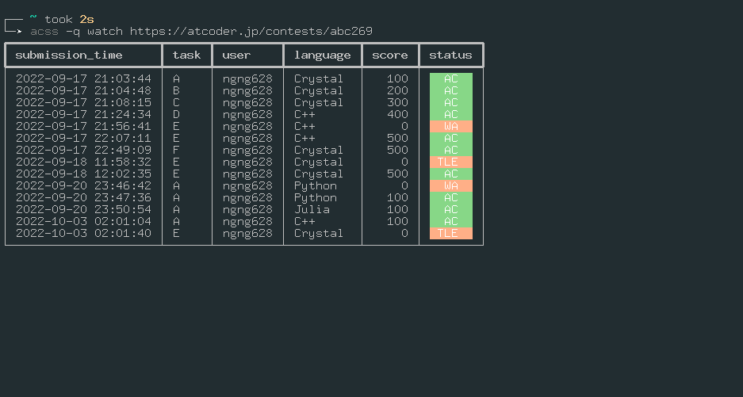

# atcoder-submit-status

`acss` はコマンドライン上でAtCoderの提出状況を確認するためのCLIツールです。
提出状況を取得することに特化しています。

## スクリーンショット



## 機能

### 基本

コマンドは以下の形式で与えます。

```shell
$ acss [-h] [-v] [-c COOKIE] [-q] [--version] {login,l,logout,watch,w} 
```

|オプション|説明|
|:-|:-|
| `-h, --help` | ヘルプを表示します |
| `-v, --verbose` | ログの出力を多くします |
| `-c COOKIE, --cookie COOKIE` | クッキーへのパスを指定します |
| `-q, --quiet` | ログの出力を少なくします（このオプションは3回まで重ねることができます） |
| `--version` | `acss` のバージョンを表示します |

### ログイン

以下のコマンドでログインすることができます。
CLI上でユーザ名の入力とパスワードの入力が求められます。

```shell
$ acss login atcoder
```

### ログアウト

以下のコマンドでログアウトすることができます。

```shell
$ acss logout atcoder
```

### 提出一覧の確認

以下のコマンドで指定したコンテストの提出一覧を取得します。

```shell
$ acss watch URL
$ acss watch https://atcoder.jp/contests/abc252  # 具体例
```

以下のオプションがサポートされています。

|オプション|説明|例|
|:-|:-|:-|
| `-h, --help` | ヘルプを表示します。 | `acss watch -h` |
| `--no-color` | 色付きの出力をオフにします。 | `acss watch URL --no-color` |
| `--tasks` | 問題で絞り込みます。 | `acss watch URL --task a b ex` |
| `--languages` | 言語で絞り込みます。 | `acss watch URL --languages C++ C#` |
| `--statuses` | ジャッジの状態で絞り込みます 。| `acss watch URL --statuses WA TLE RE` |
| `-u, --users`| ユーザ名で絞り込みます。 | `acss watch URL -u user1 user2` |
| `--info-level` | 提出の情報の詳しさを設定します。（`MINIMAL, NORMAL, DETAILS` の3段階） | `acss watch URL --info-level MINIMAL` |
| `-r, --reverse` | 提出を逆順に表示します。 | `acss watch URL -r` |
| `-t, --tail` | 全提出のうち指定した数だけ出力します。 | `acss watch URL -t 5` |

### 提出一覧の保存

`$ acss watch URL > result.txt` などとすることで、出力結果をファイルに書き込むことはできますが、不必要な空白やログ情報も書き込まれてしまいます。

そこで、提出一覧を保存する専用のコマンドを提供します。

```shell
$ acss fetch URL  # そのまま標準出力に出力
$ acss fetch URL -o result.csv  # result.csvとして保存
```

以下のオプションがサポートされています。

|オプション|説明|例|
|:-|:-|:-|
| `-h, --help` | ヘルプを表示します。 | `acss fetch -h` |
| `-o` | 結果の出力先を指定します。 | `acss fetch URL -o result.csv` |
| `-S, --separator` | 区切り文字を変更します。 | `acss fetch URL -s '\t' -o result.tsv` |
| `-e, --encoding` | 文字コードを変更します。 | `acss fetch URL -e 'sjis' -o result.csv` |
| `--tasks` | 問題で絞り込みます。 | `acss fetch URL --task a b ex` |
| `--languages` | 言語で絞り込みます。 | `acss fetch URL --languages C++ C#` |
| `--statuses` | ジャッジの状態で絞り込みます 。| `acss fetch URL --statuses WA TLE RE` |
| `-u, --users`| ユーザ名で絞り込みます。 | `acss fetch URL -u user1 user2` |
| `--info-level` | 提出の情報の詳しさを設定します。（`MINIMAL, NORMAL, DETAILS` の3段階） | `acss fetch URL --info-level MINIMAL` |
| `-t, --tail` | 全提出のうち指定した数だけ出力します。 | `acss fetch URL -t 5` |


## インストール

以下のコマンドでインストールできます。

```shell
pip install atcoder-submit-status
```

<!-- ## FAQ -->

## LICENSE

MITライセンスで提供します。

また、以下の著作物を利用しました。

```
The MIT License (MIT)
Copyright (c) 2017-2020 Kimiyuki Onaka.
https://github.com/online-judge-tools/oj/blob/master/LICENSE
```
